# Projects and dependencies analysis

This document provides a comprehensive overview of the projects and their dependencies in the context of upgrading to .NETCoreApp,Version=v10.0.

## Table of Contents

- [Executive Summary](#executive-Summary)
  - [Highlevel Metrics](#highlevel-metrics)
  - [Projects Compatibility](#projects-compatibility)
  - [Package Compatibility](#package-compatibility)
  - [API Compatibility](#api-compatibility)
- [Aggregate NuGet packages details](#aggregate-nuget-packages-details)
- [Top API Migration Challenges](#top-api-migration-challenges)
  - [Technologies and Features](#technologies-and-features)
  - [Most Frequent API Issues](#most-frequent-api-issues)
- [Projects Relationship Graph](#projects-relationship-graph)
- [Project Details](#project-details)

  - [ShipExecNavigator.AppLogic\ShipExecNavigator.AppLogic.csproj](#shipexecnavigatorapplogicshipexecnavigatorapplogiccsproj)
  - [ShipExecNavigator.BusinessLogic\ShipExecNavigator.BusinessLogic.csproj](#shipexecnavigatorbusinesslogicshipexecnavigatorbusinesslogiccsproj)
  - [ShipExecNavigator.ClientSpecificLogic\ShipExecNavigator.ClientSpecificLogic.csproj](#shipexecnavigatorclientspecificlogicshipexecnavigatorclientspecificlogiccsproj)
  - [ShipExecNavigator.DAL\ShipExecNavigator.DAL.csproj](#shipexecnavigatordalshipexecnavigatordalcsproj)
  - [ShipExecNavigator.DesktopClient\ShipExecNavigator.DesktopClient.csproj](#shipexecnavigatordesktopclientshipexecnavigatordesktopclientcsproj)
  - [ShipExecNavigator.Model\ShipExecNavigator.Model.csproj](#shipexecnavigatormodelshipexecnavigatormodelcsproj)
  - [ShipExecNavigator.RAGLoader\ShipExecNavigator.RAGLoader.csproj](#shipexecnavigatorragloadershipexecnavigatorragloadercsproj)
  - [ShipExecNavigator.Shared\ShipExecNavigator.Shared.csproj](#shipexecnavigatorsharedshipexecnavigatorsharedcsproj)
  - [ShipExecNavigator.SK\ShipExecNavigator.SK.csproj](#shipexecnavigatorskshipexecnavigatorskcsproj)
  - [ShipExecNavigator\ShipExecNavigator.csproj](#shipexecnavigatorshipexecnavigatorcsproj)

## Executive Summary

### Highlevel Metrics

| Metric | Count | Status |
| :--- | :---: | :--- |
| Total Projects | 10 | 3 require upgrade |
| Total NuGet Packages | 14 | 1 need upgrade |
| Total Code Files | 84 |  |
| Total Code Files with Incidents | 10 |  |
| Total Lines of Code | 10346 |  |
| Total Number of Issues | 59 |  |
| Estimated LOC to modify | 51+ | at least 0.5% of codebase |

### Projects Compatibility

| Project | Target Framework | Difficulty | Package Issues | API Issues | Est. LOC Impact | Description |
| :--- | :---: | :---: | :---: | :---: | :---: | :--- |
| [ShipExecNavigator.AppLogic\ShipExecNavigator.AppLogic.csproj](#shipexecnavigatorapplogicshipexecnavigatorapplogiccsproj) | net10.0 | ✅ None | 0 | 0 |  | ClassLibrary, Sdk Style = True |
| [ShipExecNavigator.BusinessLogic\ShipExecNavigator.BusinessLogic.csproj](#shipexecnavigatorbusinesslogicshipexecnavigatorbusinesslogiccsproj) | net48 | 🟢 Low | 1 | 51 | 51+ | ClassicClassLibrary, Sdk Style = False |
| [ShipExecNavigator.ClientSpecificLogic\ShipExecNavigator.ClientSpecificLogic.csproj](#shipexecnavigatorclientspecificlogicshipexecnavigatorclientspecificlogiccsproj) | net48 | 🟢 Low | 0 | 0 |  | ClassicClassLibrary, Sdk Style = False |
| [ShipExecNavigator.DAL\ShipExecNavigator.DAL.csproj](#shipexecnavigatordalshipexecnavigatordalcsproj) | net10.0 | ✅ None | 0 | 0 |  | ClassLibrary, Sdk Style = True |
| [ShipExecNavigator.DesktopClient\ShipExecNavigator.DesktopClient.csproj](#shipexecnavigatordesktopclientshipexecnavigatordesktopclientcsproj) | net10.0-windows | ✅ None | 0 | 0 |  | Wpf, Sdk Style = True |
| [ShipExecNavigator.Model\ShipExecNavigator.Model.csproj](#shipexecnavigatormodelshipexecnavigatormodelcsproj) | net48 | 🟢 Low | 1 | 0 |  | ClassicClassLibrary, Sdk Style = False |
| [ShipExecNavigator.RAGLoader\ShipExecNavigator.RAGLoader.csproj](#shipexecnavigatorragloadershipexecnavigatorragloadercsproj) | net10.0 | ✅ None | 0 | 0 |  | DotNetCoreApp, Sdk Style = True |
| [ShipExecNavigator.Shared\ShipExecNavigator.Shared.csproj](#shipexecnavigatorsharedshipexecnavigatorsharedcsproj) | net10.0 | ✅ None | 0 | 0 |  | ClassLibrary, Sdk Style = True |
| [ShipExecNavigator.SK\ShipExecNavigator.SK.csproj](#shipexecnavigatorskshipexecnavigatorskcsproj) | net10.0 | ✅ None | 0 | 0 |  | ClassLibrary, Sdk Style = True |
| [ShipExecNavigator\ShipExecNavigator.csproj](#shipexecnavigatorshipexecnavigatorcsproj) | net10.0 | ✅ None | 0 | 0 |  | AspNetCore, Sdk Style = True |

### Package Compatibility

| Status | Count | Percentage |
| :--- | :---: | :---: |
| ✅ Compatible | 13 | 92.9% |
| ⚠️ Incompatible | 1 | 7.1% |
| 🔄 Upgrade Recommended | 0 | 0.0% |
| ***Total NuGet Packages*** | ***14*** | ***100%*** |

### API Compatibility

| Category | Count | Impact |
| :--- | :---: | :--- |
| 🔴 Binary Incompatible | 0 | High - Require code changes |
| 🟡 Source Incompatible | 0 | Medium - Needs re-compilation and potential conflicting API error fixing |
| 🔵 Behavioral change | 51 | Low - Behavioral changes that may require testing at runtime |
| ✅ Compatible | 8652 |  |
| ***Total APIs Analyzed*** | ***8703*** |  |

## Aggregate NuGet packages details

| Package | Current Version | Suggested Version | Projects | Description |
| :--- | :---: | :---: | :--- | :--- |
| Dapper | 2.1.66 |  | [ShipExecNavigator.DAL.csproj](#shipexecnavigatordalshipexecnavigatordalcsproj) | ✅Compatible |
| Microsoft.AspNet.Identity.Core | 2.2.4 |  | [ShipExecNavigator.BusinessLogic.csproj](#shipexecnavigatorbusinesslogicshipexecnavigatorbusinesslogiccsproj) [ShipExecNavigator.Model.csproj](#shipexecnavigatormodelshipexecnavigatormodelcsproj) | ⚠️NuGet package is incompatible |
| Microsoft.Data.SqlClient | 6.0.2 |  | [ShipExecNavigator.DAL.csproj](#shipexecnavigatordalshipexecnavigatordalcsproj) | ✅Compatible |
| Microsoft.Extensions.Configuration | 10.0.5 |  | [ShipExecNavigator.RAGLoader.csproj](#shipexecnavigatorragloadershipexecnavigatorragloadercsproj) | ✅Compatible |
| Microsoft.Extensions.Configuration.Abstractions | 10.0.5 |  | [ShipExecNavigator.SK.csproj](#shipexecnavigatorskshipexecnavigatorskcsproj) | ✅Compatible |
| Microsoft.Extensions.Configuration.Json | 10.0.5 |  | [ShipExecNavigator.RAGLoader.csproj](#shipexecnavigatorragloadershipexecnavigatorragloadercsproj) | ✅Compatible |
| Microsoft.SemanticKernel | 1.54.0 |  | [ShipExecNavigator.SK.csproj](#shipexecnavigatorskshipexecnavigatorskcsproj) | ✅Compatible |
| Microsoft.SemanticKernel.Connectors.AzureOpenAI | 1.54.0 |  | [ShipExecNavigator.RAGLoader.csproj](#shipexecnavigatorragloadershipexecnavigatorragloadercsproj) [ShipExecNavigator.SK.csproj](#shipexecnavigatorskshipexecnavigatorskcsproj) | ✅Compatible |
| Microsoft.SemanticKernel.Connectors.OpenAI | 1.54.0 |  | [ShipExecNavigator.SK.csproj](#shipexecnavigatorskshipexecnavigatorskcsproj) | ✅Compatible |
| Newtonsoft.Json | 13.0.3 |  | [ShipExecNavigator.csproj](#shipexecnavigatorshipexecnavigatorcsproj) | ✅Compatible |
| Qdrant.Client | 1.17.0 |  | [ShipExecNavigator.SK.csproj](#shipexecnavigatorskshipexecnavigatorskcsproj) | ✅Compatible |
| System.IO.Ports | 10.0.3 |  | [ShipExecNavigator.csproj](#shipexecnavigatorshipexecnavigatorcsproj) | ✅Compatible |
| UglyToad.PdfPig | 1.7.0-custom-5 |  | [ShipExecNavigator.RAGLoader.csproj](#shipexecnavigatorragloadershipexecnavigatorragloadercsproj) | ✅Compatible |
| UglyToad.PdfPig.DocumentLayoutAnalysis | 1.7.0-custom-5 |  | [ShipExecNavigator.RAGLoader.csproj](#shipexecnavigatorragloadershipexecnavigatorragloadercsproj) | ✅Compatible |

## Top API Migration Challenges

### Technologies and Features

| Technology | Issues | Percentage | Migration Path |
| :--- | :---: | :---: | :--- |

### Most Frequent API Issues

| API | Count | Percentage | Category |
| :--- | :---: | :---: | :--- |
| T:System.Net.Http.HttpContent | 47 | 92.2% | Behavioral Change |
| T:System.Xml.Serialization.XmlSerializer | 4 | 7.8% | Behavioral Change |

## Projects Relationship Graph

Legend:
📦 SDK-style project
⚙️ Classic project

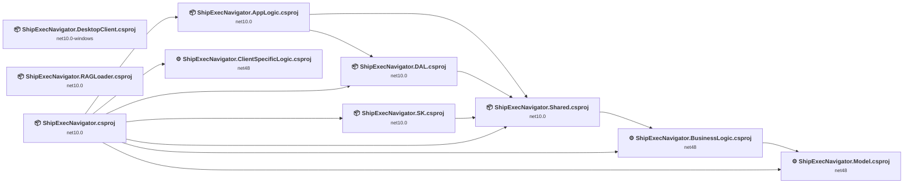

## Project Details

### ShipExecNavigator.AppLogic\ShipExecNavigator.AppLogic.csproj

#### Project Info

- **Current Target Framework:** net10.0✅
- **SDK-style**: True
- **Project Kind:** ClassLibrary
- **Dependencies**: 2
- **Dependants**: 1
- **Number of Files**: 1
- **Lines of Code**: 205
- **Estimated LOC to modify**: 0+ (at least 0.0% of the project)

#### Dependency Graph

Legend:
📦 SDK-style project
⚙️ Classic project

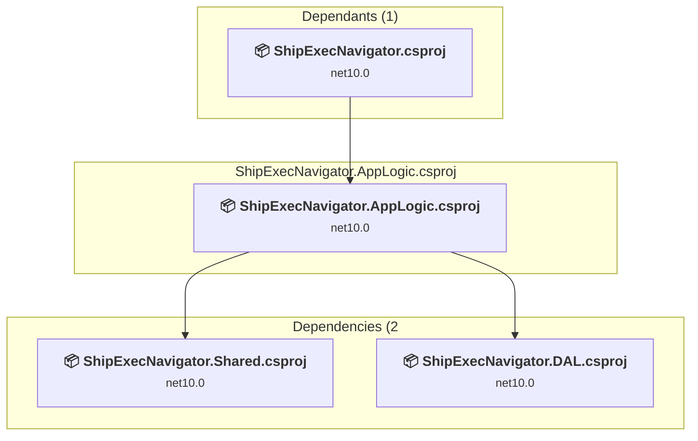

### API Compatibility

| Category | Count | Impact |
| :--- | :---: | :--- |
| 🔴 Binary Incompatible | 0 | High - Require code changes |
| 🟡 Source Incompatible | 0 | Medium - Needs re-compilation and potential conflicting API error fixing |
| 🔵 Behavioral change | 0 | Low - Behavioral changes that may require testing at runtime |
| ✅ Compatible | 0 |  |
| ***Total APIs Analyzed*** | ***0*** |  |

### ShipExecNavigator.BusinessLogic\ShipExecNavigator.BusinessLogic.csproj

#### Project Info

- **Current Target Framework:** net48
- **Proposed Target Framework:** net10.0
- **SDK-style**: False
- **Project Kind:** ClassicClassLibrary
- **Dependencies**: 1
- **Dependants**: 2
- **Number of Files**: 21
- **Number of Files with Incidents**: 8
- **Lines of Code**: 5868
- **Estimated LOC to modify**: 51+ (at least 0.9% of the project)

#### Dependency Graph

Legend:
📦 SDK-style project
⚙️ Classic project

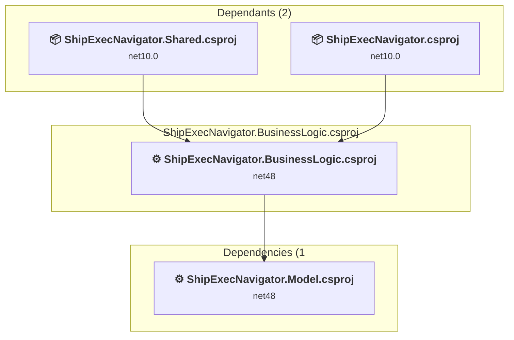

### API Compatibility

| Category | Count | Impact |
| :--- | :---: | :--- |
| 🔴 Binary Incompatible | 0 | High - Require code changes |
| 🟡 Source Incompatible | 0 | Medium - Needs re-compilation and potential conflicting API error fixing |
| 🔵 Behavioral change | 51 | Low - Behavioral changes that may require testing at runtime |
| ✅ Compatible | 8524 |  |
| ***Total APIs Analyzed*** | ***8575*** |  |

### ShipExecNavigator.ClientSpecificLogic\ShipExecNavigator.ClientSpecificLogic.csproj

#### Project Info

- **Current Target Framework:** net48
- **Proposed Target Framework:** net10.0
- **SDK-style**: False
- **Project Kind:** ClassicClassLibrary
- **Dependencies**: 0
- **Dependants**: 1
- **Number of Files**: 6
- **Number of Files with Incidents**: 1
- **Lines of Code**: 141
- **Estimated LOC to modify**: 0+ (at least 0.0% of the project)

#### Dependency Graph

Legend:
📦 SDK-style project
⚙️ Classic project

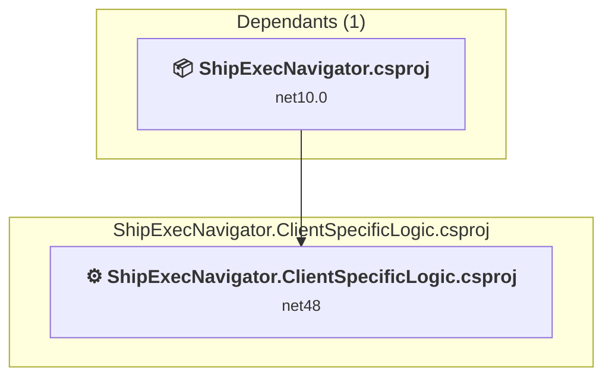

### API Compatibility

| Category | Count | Impact |
| :--- | :---: | :--- |
| 🔴 Binary Incompatible | 0 | High - Require code changes |
| 🟡 Source Incompatible | 0 | Medium - Needs re-compilation and potential conflicting API error fixing |
| 🔵 Behavioral change | 0 | Low - Behavioral changes that may require testing at runtime |
| ✅ Compatible | 112 |  |
| ***Total APIs Analyzed*** | ***112*** |  |

### ShipExecNavigator.DAL\ShipExecNavigator.DAL.csproj

#### Project Info

- **Current Target Framework:** net10.0✅
- **SDK-style**: True
- **Project Kind:** ClassLibrary
- **Dependencies**: 1
- **Dependants**: 2
- **Number of Files**: 8
- **Lines of Code**: 451
- **Estimated LOC to modify**: 0+ (at least 0.0% of the project)

#### Dependency Graph

Legend:
📦 SDK-style project
⚙️ Classic project

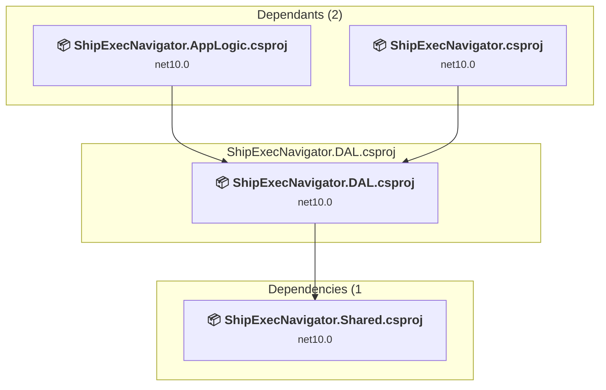

### API Compatibility

| Category | Count | Impact |
| :--- | :---: | :--- |
| 🔴 Binary Incompatible | 0 | High - Require code changes |
| 🟡 Source Incompatible | 0 | Medium - Needs re-compilation and potential conflicting API error fixing |
| 🔵 Behavioral change | 0 | Low - Behavioral changes that may require testing at runtime |
| ✅ Compatible | 0 |  |
| ***Total APIs Analyzed*** | ***0*** |  |

### ShipExecNavigator.DesktopClient\ShipExecNavigator.DesktopClient.csproj

#### Project Info

- **Current Target Framework:** net10.0-windows✅
- **SDK-style**: True
- **Project Kind:** Wpf
- **Dependencies**: 0
- **Dependants**: 0
- **Number of Files**: 2
- **Lines of Code**: 56
- **Estimated LOC to modify**: 0+ (at least 0.0% of the project)

#### Dependency Graph

Legend:
📦 SDK-style project
⚙️ Classic project

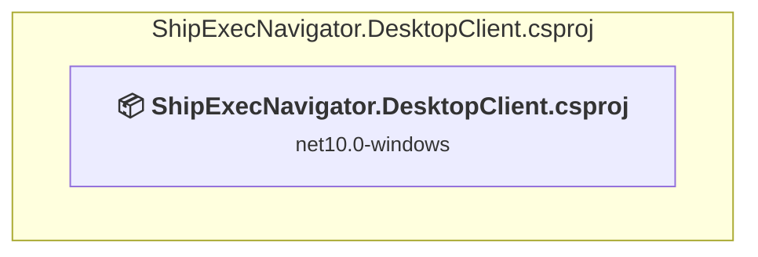

### API Compatibility

| Category | Count | Impact |
| :--- | :---: | :--- |
| 🔴 Binary Incompatible | 0 | High - Require code changes |
| 🟡 Source Incompatible | 0 | Medium - Needs re-compilation and potential conflicting API error fixing |
| 🔵 Behavioral change | 0 | Low - Behavioral changes that may require testing at runtime |
| ✅ Compatible | 0 |  |
| ***Total APIs Analyzed*** | ***0*** |  |

### ShipExecNavigator.Model\ShipExecNavigator.Model.csproj

#### Project Info

- **Current Target Framework:** net48
- **Proposed Target Framework:** net10.0
- **SDK-style**: False
- **Project Kind:** ClassicClassLibrary
- **Dependencies**: 0
- **Dependants**: 2
- **Number of Files**: 2
- **Number of Files with Incidents**: 1
- **Lines of Code**: 55
- **Estimated LOC to modify**: 0+ (at least 0.0% of the project)

#### Dependency Graph

Legend:
📦 SDK-style project
⚙️ Classic project

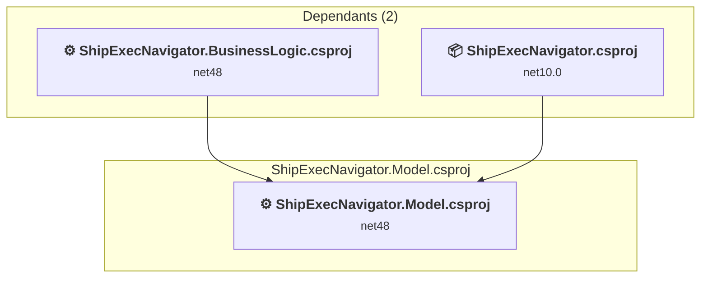

### API Compatibility

| Category | Count | Impact |
| :--- | :---: | :--- |
| 🔴 Binary Incompatible | 0 | High - Require code changes |
| 🟡 Source Incompatible | 0 | Medium - Needs re-compilation and potential conflicting API error fixing |
| 🔵 Behavioral change | 0 | Low - Behavioral changes that may require testing at runtime |
| ✅ Compatible | 16 |  |
| ***Total APIs Analyzed*** | ***16*** |  |

### ShipExecNavigator.RAGLoader\ShipExecNavigator.RAGLoader.csproj

#### Project Info

- **Current Target Framework:** net10.0✅
- **SDK-style**: True
- **Project Kind:** DotNetCoreApp
- **Dependencies**: 0
- **Dependants**: 0
- **Number of Files**: 4
- **Lines of Code**: 298
- **Estimated LOC to modify**: 0+ (at least 0.0% of the project)

#### Dependency Graph

Legend:
📦 SDK-style project
⚙️ Classic project

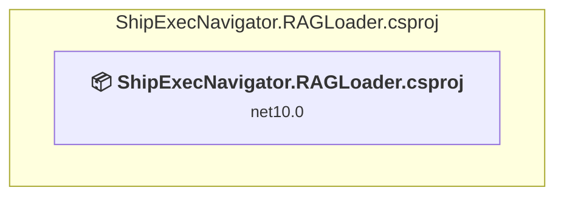

### API Compatibility

| Category | Count | Impact |
| :--- | :---: | :--- |
| 🔴 Binary Incompatible | 0 | High - Require code changes |
| 🟡 Source Incompatible | 0 | Medium - Needs re-compilation and potential conflicting API error fixing |
| 🔵 Behavioral change | 0 | Low - Behavioral changes that may require testing at runtime |
| ✅ Compatible | 0 |  |
| ***Total APIs Analyzed*** | ***0*** |  |

### ShipExecNavigator.Shared\ShipExecNavigator.Shared.csproj

#### Project Info

- **Current Target Framework:** net10.0✅
- **SDK-style**: True
- **Project Kind:** ClassLibrary
- **Dependencies**: 1
- **Dependants**: 4
- **Number of Files**: 29
- **Lines of Code**: 940
- **Estimated LOC to modify**: 0+ (at least 0.0% of the project)

#### Dependency Graph

Legend:
📦 SDK-style project
⚙️ Classic project

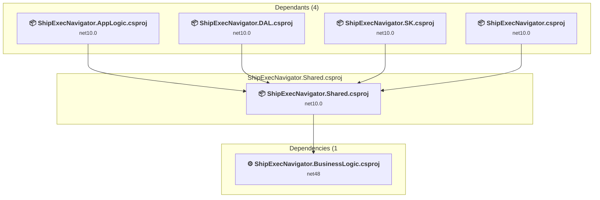

### API Compatibility

| Category | Count | Impact |
| :--- | :---: | :--- |
| 🔴 Binary Incompatible | 0 | High - Require code changes |
| 🟡 Source Incompatible | 0 | Medium - Needs re-compilation and potential conflicting API error fixing |
| 🔵 Behavioral change | 0 | Low - Behavioral changes that may require testing at runtime |
| ✅ Compatible | 0 |  |
| ***Total APIs Analyzed*** | ***0*** |  |

### ShipExecNavigator.SK\ShipExecNavigator.SK.csproj

#### Project Info

- **Current Target Framework:** net10.0✅
- **SDK-style**: True
- **Project Kind:** ClassLibrary
- **Dependencies**: 1
- **Dependants**: 1
- **Number of Files**: 6
- **Lines of Code**: 430
- **Estimated LOC to modify**: 0+ (at least 0.0% of the project)

#### Dependency Graph

Legend:
📦 SDK-style project
⚙️ Classic project

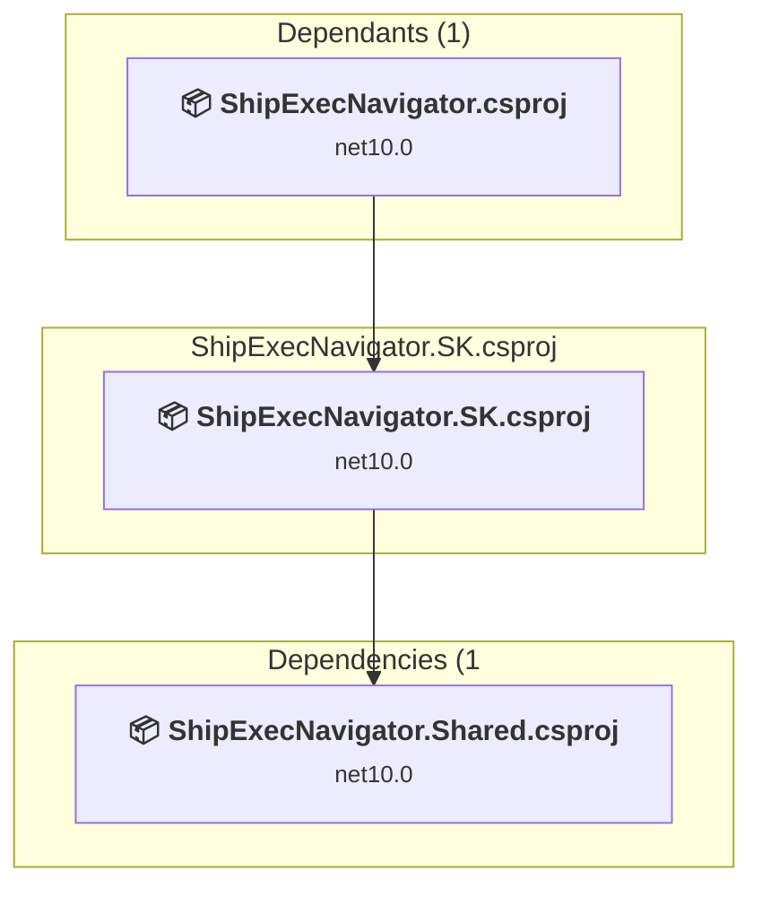

### API Compatibility

| Category | Count | Impact |
| :--- | :---: | :--- |
| 🔴 Binary Incompatible | 0 | High - Require code changes |
| 🟡 Source Incompatible | 0 | Medium - Needs re-compilation and potential conflicting API error fixing |
| 🔵 Behavioral change | 0 | Low - Behavioral changes that may require testing at runtime |
| ✅ Compatible | 0 |  |
| ***Total APIs Analyzed*** | ***0*** |  |

### ShipExecNavigator\ShipExecNavigator.csproj

#### Project Info

- **Current Target Framework:** net10.0✅
- **SDK-style**: True
- **Project Kind:** AspNetCore
- **Dependencies**: 7
- **Dependants**: 0
- **Number of Files**: 45
- **Lines of Code**: 1902
- **Estimated LOC to modify**: 0+ (at least 0.0% of the project)

#### Dependency Graph

Legend:
📦 SDK-style project
⚙️ Classic project

```mermaid
flowchart TB
    subgraph current["ShipExecNavigator.csproj"]
        MAIN["<b>📦&nbsp;ShipExecNavigator.csproj</b><br/><small>net10.0</small>"]
        click MAIN "#shipexecnavigatorshipexecnavigatorcsproj"
    end
    subgraph downstream["Dependencies (7"]
        P9["<b>📦&nbsp;ShipExecNavigator.SK.csproj</b><br/><small>net10.0</small>"]
        P3["<b>⚙️&nbsp;ShipExecNavigator.ClientSpecificLogic.csproj</b><br/><small>net48</small>"]
        P8["<b>📦&nbsp;ShipExecNavigator.Shared.csproj</b><br/><small>net10.0</small>"]
        P6["<b>⚙️&nbsp;ShipExecNavigator.Model.csproj</b><br/><small>net48</small>"]
        P2["<b>⚙️&nbsp;ShipExecNavigator.BusinessLogic.csproj</b><br/><small>net48</small>"]
        P4["<b>📦&nbsp;ShipExecNavigator.DAL.csproj</b><br/><small>net10.0</small>"]
        P1["<b>📦&nbsp;ShipExecNavigator.AppLogic.csproj</b><br/><small>net10.0</small>"]
        click P9 "#shipexecnavigatorskshipexecnavigatorskcsproj"
        click P3 "#shipexecnavigatorclientspecificlogicshipexecnavigatorclientspecificlogiccsproj"
        click P8 "#shipexecnavigatorsharedshipexecnavigatorsharedcsproj"
        click P6 "#shipexecnavigatormodelshipexecnavigatormodelcsproj"
        click P2 "#shipexecnavigatorbusinesslogicshipexecnavigatorbusinesslogiccsproj"
        click P4 "#shipexecnavigatordalshipexecnavigatordalcsproj"
        click P1 "#shipexecnavigatorapplogicshipexecnavigatorapplogiccsproj"
    end
    MAIN --> P9
    MAIN --> P3
    MAIN --> P8
    MAIN --> P6
    MAIN --> P2
    MAIN --> P4
    MAIN --> P1

```

### API Compatibility

| Category | Count | Impact |
| :--- | :---: | :--- |
| 🔴 Binary Incompatible | 0 | High - Require code changes |
| 🟡 Source Incompatible | 0 | Medium - Needs re-compilation and potential conflicting API error fixing |
| 🔵 Behavioral change | 0 | Low - Behavioral changes that may require testing at runtime |
| ✅ Compatible | 0 |  |
| ***Total APIs Analyzed*** | ***0*** |  |

